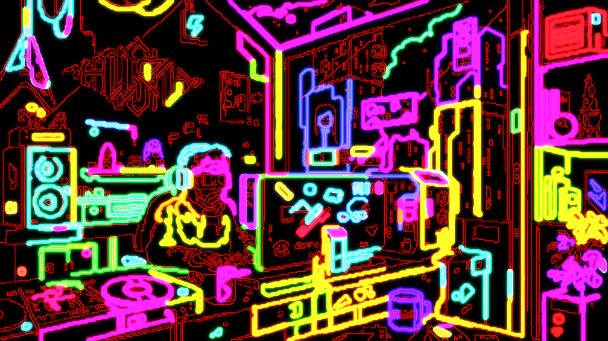

# NeonBuzz

<p align="center">
  
</p>

An OpenGL-based real-time image processing application that transforms photographs into artistic contour and brush stroke renderings. Features interactive parameter adjustment, multiple display modes, and advanced noise reduction algorithms.

## ✨ Features

- **Real-time Edge Detection** - Canny edge detection with adjustable thresholds
- **Contour Extraction** - Automatic contour detection with area and length filtering
- **Artistic Brush Strokes** - Stylized brush stroke rendering with density-adaptive edge following
- **Multiple Display Modes**:
  - Original Image
  - Edge Detection View
  - Contour Overlay
  - Brush Strokes
  - Combined View
- **Advanced Noise Reduction**:
  - Gaussian Blur
  - Bilateral Filter (edge-preserving)
  - Morphological Operations
- **Edge Smoothing**:
  - Edge Dilation with Zhang-Suen Thinning
  - Gaussian Edge Smoothing
  - Contour Polygon Approximation
- **Interactive UI** - Real-time parameter adjustment via ImGui

## 🖼️ Display Modes

| Mode | Description |
|------|-------------|
| **Original** | Shows the loaded image as-is |
| **Edges** | Displays Canny edge detection result |
| **Contours** | Shows detected contours overlaid on the image |
| **Brush Strokes** | Artistic brush stroke rendering on black background |
| **Combined** | Brush strokes with contour lines overlaid |

## 🛠️ Requirements

### Dependencies

- **OpenGL** 4.1+
- **GLFW** 3.x
- **GLEW** 2.x
- **OpenCV** 4.x (with contrib modules for `ximgproc`)
- **CMake** 3.20+
- **C++17** compatible compiler

### Installing Dependencies

#### Ubuntu/Debian

```bash
sudo apt update
sudo apt install build-essential cmake libglfw3-dev libglew-dev libopencv-dev libopencv-contrib-dev
```

#### Fedora

```bash
sudo dnf install cmake glfw-devel glew-devel opencv-devel opencv-contrib
```

#### Arch Linux

```bash
sudo pacman -S cmake glfw glew opencv
```

#### macOS (Homebrew)

```bash
brew install cmake glfw glew opencv
```

## 🚀 Building

### Clone the Repository

```bash
git clone https://github.com/yourusername/NeonBuzz.git
cd NeonBuzz
```

### Build with CMake

```bash
# Configure
cmake -B build -S .

# Compile
make -C build -j$(nproc)
```

### VS Code Tasks

The project includes VS Code tasks for convenient building:

- **Build** (`Ctrl+Shift+B`): Runs CMake configuration
- **Compile**: Runs make to compile the project
- **Build & Run**: Compiles and launches the application

## 📖 Usage

### Basic Usage

```bash
# Run without arguments (use file browser to load images)
./build/NeonBuzz

# Load an image directly
./build/NeonBuzz path/to/your/image.jpg
```

### Supported Image Formats

- PNG
- JPEG
- BMP
- GIF
- TIFF
- WebP

### Controls

1. **Load Image**: Click "Browse..." or enter a path and click "Load"
2. **Display Mode**: Select from the dropdown to switch views
3. **Parameters**: Adjust sliders to modify processing in real-time
4. **Viewport**: View the processed image in the main window

## ⚙️ Parameter Guide

### Edge Detection Parameters

| Parameter | Range | Description |
|-----------|-------|-------------|
| **Canny T1** | 10-200 | Lower threshold for edge detection |
| **Canny T2** | 50-400 | Upper threshold for edge detection |
| **Min Contour Area** | 1-1000 | Minimum contour area in pixels² |
| **Min Contour Length** | 1-200 | Minimum contour perimeter in pixels |

### Noise Reduction

| Parameter | Range | Description |
|-----------|-------|-------------|
| **Blur Strength** | 1-21 | Gaussian blur kernel size (odd values) |
| **Bilateral Filter** | On/Off | Toggle edge-preserving blur |
| **Bilateral Diameter** | 3-21 | Neighborhood diameter for bilateral filter |
| **Sigma Color** | 10-200 | Color space sigma for bilateral filter |
| **Sigma Space** | 10-200 | Coordinate space sigma for bilateral filter |
| **Morphology Size** | 0-7 | Cleanup kernel size (0=disabled) |

### Edge Smoothing

| Parameter | Range | Description |
|-----------|-------|-------------|
| **Edge Dilation** | 0-7 | Connect fragmented edges (0=disabled) |
| **Edge Blur** | 0-11 | Smooth jagged edges (0=disabled) |
| **Contour Smoothing** | 0-10 | Simplify contour curves (0=disabled) |

### Brush Stroke Settings

| Parameter | Range | Description |
|-----------|-------|-------------|
| **Brush Size** | 1-15 | Base stroke thickness |
| **Brush Density** | 1-20 | Controls secondary stroke frequency |

The brush stroke algorithm uses:
- **Density-adaptive rendering**: High-density edge areas (like eyes, hair) have fewer strokes to prevent over-saturation
- **Edge-following strokes**: Strokes follow edge tangent direction with minimal angle variation (0.5°-5°)
- **Consistent brightness**: Stroke brightness is adjusted based on local edge density for uniform appearance

### Stroke Settings

| Parameter | Description |
|-----------|-------------|
| **Stroke Color** | RGBA color picker for contour lines |
| **Stroke Width** | Line width for contour rendering |

## 📐 Project Structure

```
NeonBuzz/
├── CMakeLists.txt          # Build configuration
├── README.md               # This file
├── Working.md              # Detailed technical documentation
├── setup.sh                # Setup script
├── imgui.ini               # ImGui layout settings
├── assets/                 # Asset files
├── include/
│   ├── App.h              # Main application class
│   ├── ImageProcessor.h   # Image processing class
│   └── Renderer.h         # OpenGL rendering class
├── src/
│   ├── main.cpp           # Entry point
│   ├── App.cpp            # Application implementation
│   ├── ImageProcessor.cpp # Image processing implementation
│   └── Renderer.cpp       # Rendering implementation
├── third_party/
│   ├── imgui/             # Dear ImGui library
│   └── tinyfiledialogs/   # Native file dialog library
└── build/                  # Build output directory
```

## 🎨 How It Works

1. **Image Loading**: Images are loaded via OpenCV and scaled to max 1024px for performance
2. **Edge Detection**: Canny algorithm with configurable thresholds detects edges
3. **Noise Reduction**: Gaussian or bilateral blur smooths noise before edge detection
4. **Contour Finding**: OpenCV extracts contours from edge map, filtered by area/length
5. **Brush Strokes**: Artistic strokes follow edge directions with density-adaptive rendering:
   - Strokes closely follow edge tangent direction (0.5°-5° variation)
   - High-density areas (eyes, hair) automatically skip strokes to prevent over-saturation
   - Brightness adjusts based on local density for uniform appearance
6. **Rendering**: OpenGL renders the result as a textured quad via ImGui viewport

For complete technical details, see [Working.md](Working.md).

## 🧪 Tips for Best Results

### For Clean Line Art

- Increase **Canny T1** and **Canny T2** to reduce noise
- Enable **Bilateral Filter** to preserve edges while smoothing
- Set **Morphology Size** to 2-3 to clean up small artifacts
- Increase **Min Contour Area** and **Min Contour Length** to filter small noise

### For Smooth Hair/Fine Details

- Set **Edge Dilation** to 2-3 to connect fragmented strands
- Use **Edge Blur** at 3-5 to smooth jagged edges
- Enable **Contour Smoothing** at 1-2 for cleaner curves

### For Sketchy Effect

- Reduce **Canny T1** for more edges
- Increase **Brush Size** for bolder strokes
- Lower **Brush Density** for more texture

## 📝 License

This project is licensed under the MIT License - see the [LICENSE](LICENSE) file for details.

## 🙏 Acknowledgments

- [Dear ImGui](https://github.com/ocornut/imgui) - Immediate mode GUI library
- [OpenCV](https://opencv.org/) - Computer vision library
- [GLFW](https://www.glfw.org/) - Window and input library
- [GLEW](http://glew.sourceforge.net/) - OpenGL extension loading
- [tinyfiledialogs](https://sourceforge.net/projects/tinyfiledialogs/) - Native file dialogs

## 🤝 Contributing

Contributions are welcome! Please feel free to submit a Pull Request.

1. Fork the repository
2. Create your feature branch (`git checkout -b feature/AmazingFeature`)
3. Commit your changes (`git commit -m 'Add some AmazingFeature'`)
4. Push to the branch (`git push origin feature/AmazingFeature`)
5. Open a Pull Request

## 📧 Contact

For questions or feedback, please open an issue on GitHub.

---

Made with ❤️ and OpenGL
